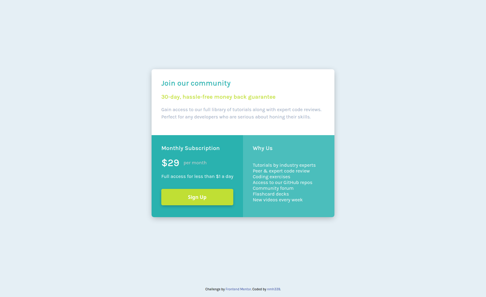

# Frontend Mentor - Single price grid component solution

This is a solution to the [Single price grid component challenge on Frontend Mentor](https://www.frontendmentor.io/challenges/single-price-grid-component-5ce41129d0ff452fec5abbbc). Frontend Mentor challenges help you improve your coding skills by building realistic projects.

## Table of contents

- [Overview](#overview)
  - [The challenge](#the-challenge)
  - [Screenshot](#screenshot)
  - [Links](#links)
- [My process](#my-process)
  - [Built with](#built-with)
  - [What I learned](#what-i-learned)
  - [Continued development](#continued-development)
  - [Useful resources](#useful-resources)
- [Author](#author)

## Overview

### The challenge

Users should be able to:

- View the optimal layout for the component depending on their device's screen size
- See a hover state on desktop for the Sign Up call-to-action

### Screenshot



### Links

- Solution URL: [Single Price Grid Solution](https://www.frontendmentor.io/solutions/single-price-grid-using-css-grid-and-sass-Jsw9S3ihX)
- Live Site URL: [Single Price Grid Solution](https://nmhanson339.github.io/single-price-grid-component-master/)

## My process

### Built with

- Semantic HTML5 markup
- CSS custom properties
- Flexbox
- CSS Grid

### What I learned

Working on this application helped me to improve in the following ways:

- I improved my understanding of CSS Grid especially using the grid-template-areas property.
- I learned how to write a detailed README.md file.
- I learned the basics of writing markdown.
- I devised a technique on how to estimate CSS properties such as the margin, padding and font-
  size of a web design simply by looking at the image.
- Completing this challenge helped to increase my awareness of the minor details when developing
  an application.

I applied a hover state to the call-to-action button on the desktop layout by transitioning the button's box-shadow and opacity values when the cursor hovers the button.

```css
&:hover {
  opacity: 0.8;
  box-shadow: 0px 1px 8px -2px rgba(0, 0, 0, 0.3);
  -webkit-box-shadow: 0px 1px 8px -2px rgba(0, 0, 0, 0.3);
  -moz-box-shadow: 0px 1px 8px -2px rgba(0, 0, 0, 0.3);
}
```

### Continued development

Some areas I would like to improve on in future projects:

- Creating a systematic method to develop web applications. For example defining which instances
  are best for using native CSS tools such as CSS Grid versus using a CSS library. Also creating  
  templates that can be reused depending on an application's requirements.

- Improving code readability specifically when it comes to adding comments and whitespace usage.

- Adhering to best practices when writing semantic HTML. For example, knowing when to use an \<article\> element over a \<section\> element and vice versa.

### Useful resources

- [Learn CSS Grid in 20 minutes by codeSTACKr](https://www.youtube.com/watch?v=0-DY8J_skZ0) - This tutorial helped to refresh CSS Grid concepts. I was able to understand all the basics within 30 minutes.

- [Edge the web ruler](https://github.com/astromme/Ruler) - Helped in estimating percentages of margin, padding and font-size.

## Author

- GitHub - [nmhanson339](https://nmhanson339.github.io)
- Frontend Mentor - [@nmh339](https://www.frontendmentor.io/profile/nmhanson339)
